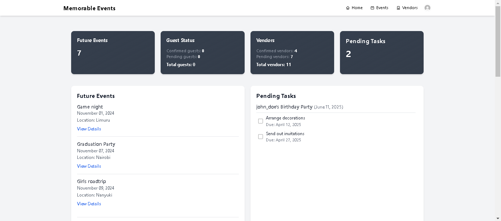
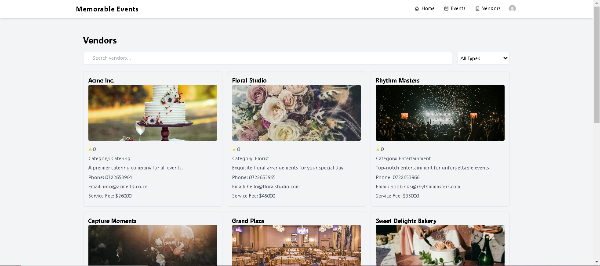
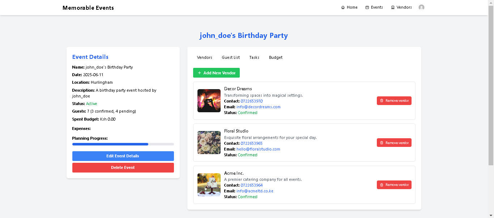

# Memorable Events

Memorable Events is a web application designed to help users plan and manage personal social events such as weddings. The application provides features for event planning, task management, vendor management, guest management, sending invitations, and tracking invitation responses.

## Table of Contents

- [Introduction](#introduction)
- [Features](#features)
- [Routes](#routes)
- [Screenshots](#screenshots)
- [Installation](#installation)
- [Usage](#usage)
- [Contributing](#contributing)
- [Contact](#contact)

## Introduction

Memorable Events is a comprehensive event management application that simplifies the process of organizing personal social events. Whether you're planning a wedding, birthday party, or any other social gathering, Memorable Events offers tools to manage every aspect efficiently. The application supports various functionalities such as creating events, managing tasks, inviting guests, and coordinating with vendors.

- **Deployed Site**: [Memorable Events](http://52.91.124.142:8000/)
- **Project Blog Article**: [Final Project Blog Article](https://www.linkedin.com/pulse/memorable-events-comprehensive-event-management-web-app-wagatwe-hyf3f/)
- **LinkedIn**: [Esther Wagatwe](https://www.linkedin.com/in/esther-wagatwe/)

## Features

- **Event Management**: Create, update, and delete events.
- **Guest Management**: Add, update, and track guests.
- **Invitation Management**: Send invitations via email and text, and track responses.
- **Vendor Management**: Manage vendors including adding reviews.
- **Task Management**: Add and track tasks related to events.
- **Authentication**: Secure user authentication with login and signup features.
- **Responsive Design**: Accessible on various devices with a responsive design.

## Routes

### Event Management

- `POST /events/` - Create a new event
- `PUT /events/<event_id>` - Update an event
- `DELETE /events/<event_id>` - Delete an event
- `GET /events/<event_id>` - Get event details

### Guest Management

- `POST /guests/` - Add a new guest
- `PUT /guests/<guest_id>` - Update a guest
- `DELETE /guests/<guest_id>` - Delete a guest
- `GET /guests/<guest_id>` - Get guest details

### Invitation Management

- `POST /events/<eventId>/invitations` - Send invitations to guests for a specific event
- `GET /events/<eventId>/invitations` - Retrieve a list of invitations sent for a specific event
- `POST /invitations/<invitation_id>/respond` - Respond to an invitation (accept/decline)

### Vendor Management

- `POST /vendors/` - Add a new vendor
- `PUT /vendors/<vendor_id>` - Update a vendor
- `DELETE /vendors/<vendor_id>` - Delete a vendor
- `GET /vendors/<vendor_id>` - Get vendor details

### Task Management

- `POST /tasks/` - Add a new task
- `PUT /tasks/<task_id>` - Update a task
- `DELETE /tasks/<task_id>` - Delete a task
- `GET /tasks/<task_id>` - Get task details

### Review Management

- `POST /reviews/` - Add a new review
- `PUT /reviews/<review_id>` - Update a review
- `DELETE /reviews/<review_id>` - Delete a review
- `GET /reviews/<review_id>` - Get review details

## Screenshots

### Dashboard

- Use the dashboard to create new events, manage guests, send invitations, add tasks, and review vendors.

### Vendors Page

- Use the vendors page to browse through a comprehensive list of available vendors and choose the best fit for your event!

### Tasks Page

- Use the tasks page to view all tasks for your events, helping you monitor your progress and ensure everything is on track.

### Event Details Page

- Use the event details page to manage your event details, add guests, and view selected vendors—all in one convenient location.

## Installation

1. Clone the repository:
   ```bash
   git clone https://github.com/Esther-Wagatwe/memorable_events_v2.git
   cd memorable_events
   ```

2. Set up the virtual environment:
   ```bash
   python3 -m venv venv
   source venv/bin/activate
   ```

3. Install the required dependencies:
   ```bash
   pip install -r requirements.txt
   ```

4. Set up the database:
   ```bash
   flask db init
   flask db migrate
   flask db upgrade
   ```

5. Run the application:
   ```bash
   flask run
   ```

## Usage

1. Access the deployed application at [Memorable Events](http://52.91.124.142:8000/).
2. Create an account or log in with your credentials.
3. Start by creating an event and adding details such as location, description, and date.
4. Manage guests by adding their contact information and sending invitations.
5. Track invitation responses and update guest statuses.
6. Add and manage tasks to keep track of all event-related activities.
7. Browse and book vendors for your event, and leave reviews based on your experience.

## Contributing

Contributions are welcome! Please follow these steps:

1. Fork the repository.
2. Create a new branch:
   ```bash
   git checkout -b feature-branch
   ```
3. Make your changes and commit them:
   ```bash
   git commit -m "Description of changes"
   ```
4. Push to the branch:
   ```bash
   git push origin feature-branch
   ```
5. Create a pull request detailing your changes.

## Contact

For any inquiries, please contact:
- **Author**: Esther Wagatwe
- **Email**: estherwagatwe@gmail.com
- **LinkedIn**: [Esther Wagatwe](https://www.linkedin.com/in/esther-wagatwe/)
- **Location**: Nairobi, Kenya

GitHub Repository: [Memorable Events](https://github.com/Esther-Wagatwe/memorable_events_v2.git)
Deployed Project Page: [Memorable Events](http://52.91.124.142:8000/)
Project Landing Page: [Memorable Events](http://52.91.124.142:8000/landing)